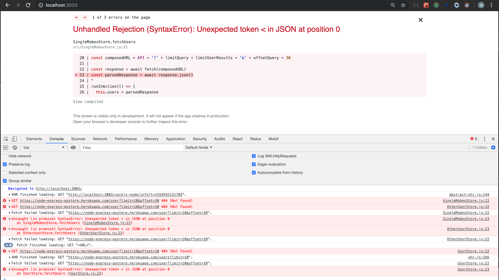

# MobX and Redux

[](https://greenkeeper.io/)

This is an easy, basic and raw (no styles attached) example of **comparing** the implementation of `MobX` and `redux`.

## Installation
```
yarn install
```

## Running the dev server
```
yarn start
```

## Handling errors
It's extremely important to manage errors properly to avoid a broken application.
Without any kind of `error handling`, for example, if we hit a non-existent endpoint like: `https://node-express-postgre.herokuapp.com/user` we will see a screen like the following.




### Notes:
I'm avoiding the use of decorators. Instead, we will use the decorate utility. More information: https://mobx.js.org/best/decorators.html


